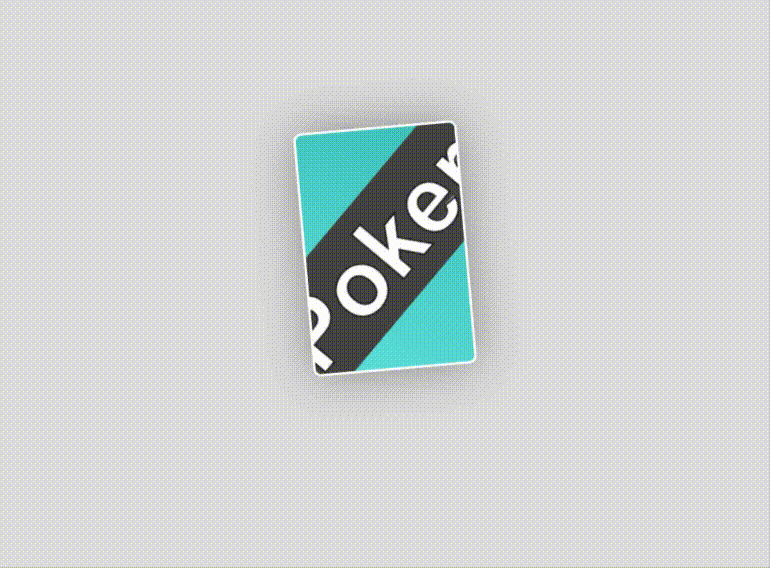

Poker-UI：一个可翻转的扑克牌组件样式
===
[https://es6.ihint.me/poker/](https://es6.ihint.me/poker/)

## 实现方式

### BSXml / BSComponent

随机牌背，点击翻牌，重力感应翻牌

[https://es6.ihint.me/poker/BSXml/index.html](https://es6.ihint.me/poker/BSXml/index.html)

1. 可以按需要实例化 Card 类来自定义扑克牌的花色、点数、卡背样式

2. 兼容性：参考 [Can I Use: module](https://caniuse.com/#search=module)
>基于 ES 6 的 Module 设计，如需向下兼容可使用 [babel](https://babeljs.io/) 转换

*有关 BSComponent 的介绍可查看：[https://pages.ihint.me/?BSXml-Component](https://pages.ihint.me/?BSXml-Component)*

----

### Web Component

全部扑克的排列，随机牌背，点击翻牌

[https://es6.ihint.me/poker/WebComponent/index.html](https://es6.ihint.me/poker/WebComponent/index.html)

1. 兼容性：参考 [Can I Use: Web Component](https://caniuse.com/#search=web%20component)
>基于 Web Component 标准的设计，如需向下兼容可使用 [Web Component Polyfill](https://github.com/webcomponents/webcomponentsjs)

*有关 Web Component 的介绍可查看：[https://developer.mozilla.org/zh-CN/docs/Web/Web_Components](https://developer.mozilla.org/zh-CN/docs/Web/Web_Components)*